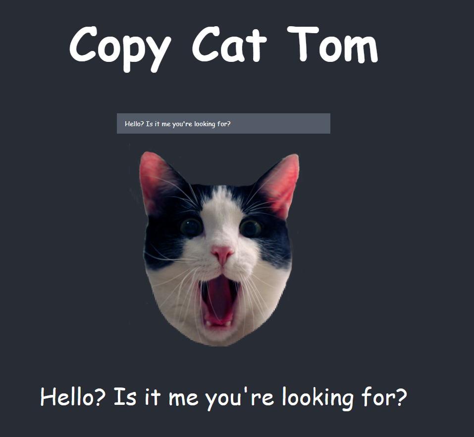

# Copy Cat 😼

In this project, I have built a program that lets users type into a textbox and allows them to visualize the immediate effect that these changes have on the web page.

This program will display a textbox with a picture of a cat beneath it. When users type into the textbox, a copy of the text will appear below the cat image, suggesting that the cat is being a copycat. Clicking on the image of the cat will toggle whether or not it is able to copy the user.

Let’s get started!

## Available Scripts

In the project directory, you can run:

### `yarn start`

Runs the app in the development mode.\
Open [http://localhost:3000](http://localhost:3000) to view it in your browser.
